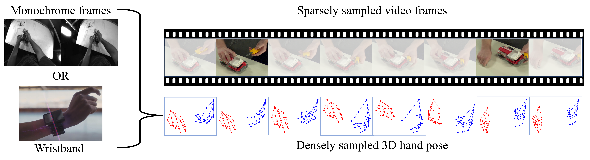

# HandFormer

PyTorch implementation of "**On the Utility of 3D Hand Poses for Action Recognition**", ECCV 2024.

[](https://arxiv.org/pdf/2403.09805)
[](https://s-shamil.github.io/HandFormer/)




## Requirements

### Environment

Create a conda environment with the necessary packages.
```
$ conda create -n handformer_env --file package_list.txt
```

### Data Preprocessing

Set the parameters and data directories in `Preprocess/config.py` and run the following:

```
$ python Preprocess/1_get_clip_data.py
$ python Preprocess/2_get_final_data.py
```
### Data Sources and Preprocessed Data 
$${\color{red}\text{Coming soon...}}$$

## Training
Set parameters in `train_config.yaml` and run `python HandFormer/train_model.py`.

## Evaluation
To obtain test scores, simply put additional placeholder columns in `test.csv` to match `train.csv`. 
Set parameters in `test_config.yaml` and run `python HandFormer/test_model.py`.
Prepare appropriate output file from the saved scores to submit to the evaluation platforms (e.g., [[Assembly101](https://codalab.lisn.upsaclay.fr/competitions/5256)][[H2O](https://codalab.lisn.upsaclay.fr/competitions/4820)].)

## Acknowledgements
This repository is based on
* [Assembly101](https://github.com/assembly-101/assembly101-action-recognition)
* [MS-G3D](https://github.com/kenziyuliu/MS-G3D)
* [ISTA-Net](https://github.com/Necolizer/ISTA-Net/)
* [HTT](https://github.com/fylwen/HTT)
  
Thanks for their great work!

## Citation
Please cite this work if you find it useful:
```
@article{shamil2024utility,
  title={On the Utility of 3D Hand Poses for Action Recognition},
  author={Shamil, Md Salman and Chatterjee, Dibyadip and Sener, Fadime and Ma, Shugao and Yao, Angela},
  journal={arXiv preprint arXiv:2403.09805},
  year={2024}
}
```
